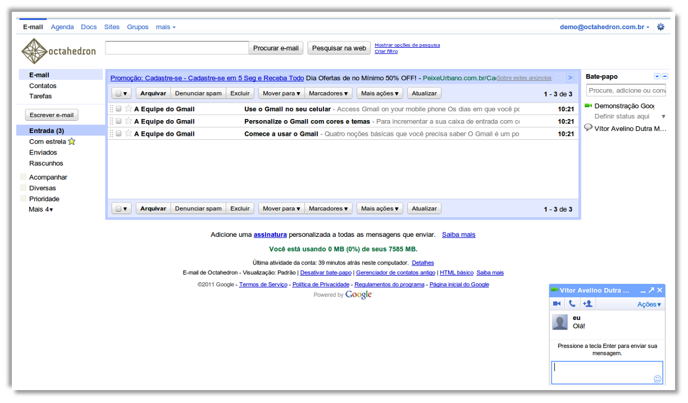
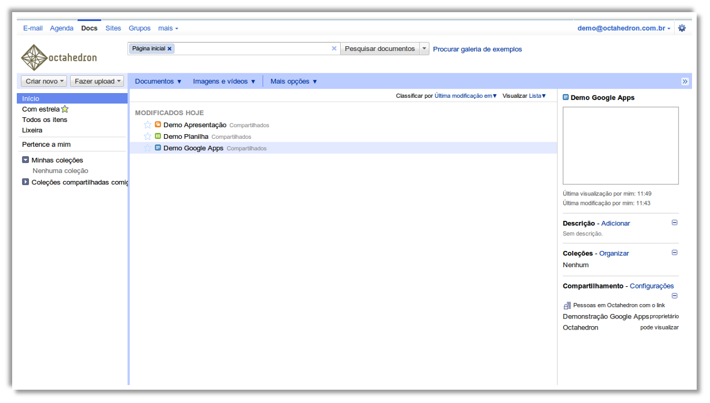
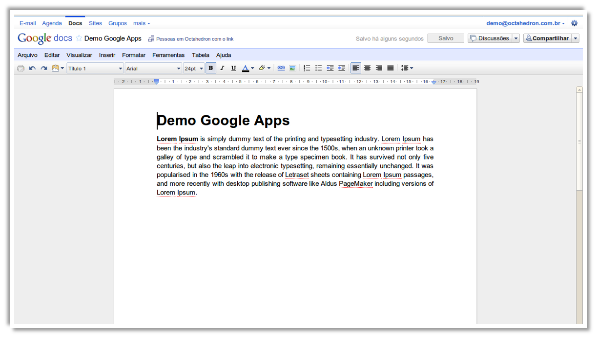
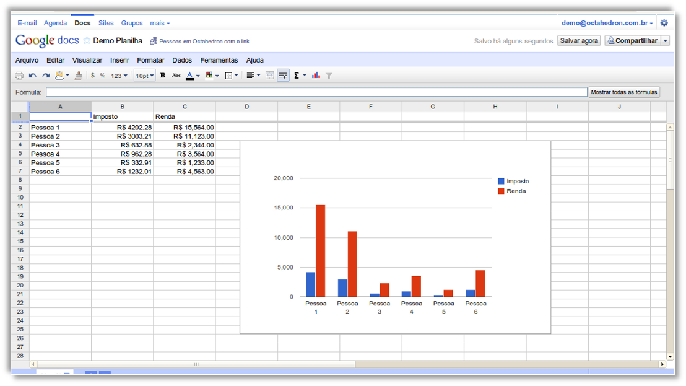
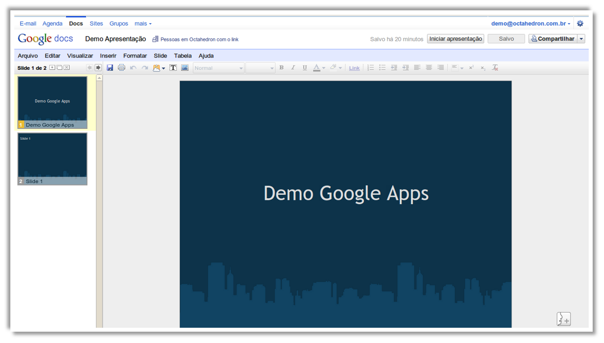
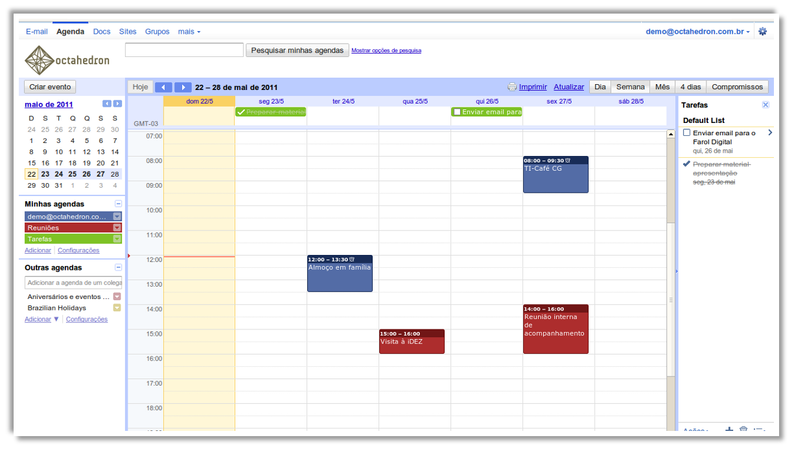
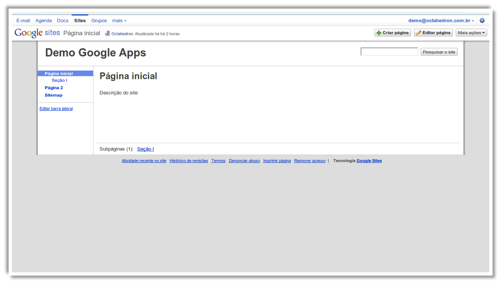
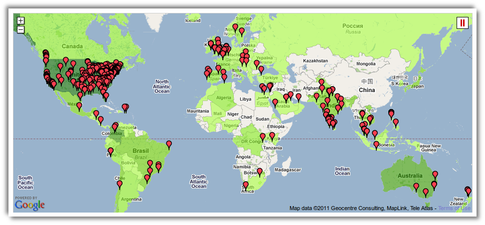

!SLIDE

   

## contato@octahedron.com.br
## http://www.octahedron.com.br/
  
## Maio/2011

!SLIDE

# O que é *Google Apps for Education*?

!SLIDE

   

## É uma suíte de colaboração e comunicação em tempo real fornecida pelo *Google*.
## Permite que instituições de ensino ofereçam o serviço à sua comunidade educativa de forma gratuita.

!SLIDE

   

Google Email com 7 GB de armazenamento, bate-papo/conferência integrado, não é preciso mais se preocupar com as quotas de email ou spam.

Google Talk mantém os estudantes em contato, mesmo quando não estiverem no campus, com mensagens instantâneas e chamadas de voz através da web. 

> **Email** fornece gigabytes de armazenamento de e-mail, spam altamente eficiente de filtragem e busca poderosa com serviços integrados de voz e vídeo.
> **Bate-papo/Conferência** permite ao usuário enviar e receber mensagens instantâneas, fazer conferência e compartilhar vídeo em tempo real com os seus colegas.

!SLIDE

   

Google Docs permite que os alunos colaborarem em tempo real sobre documentos, planilhas e apresentações, no campus ou ao redor do mundo.

> **Documentos** permite aos usuários criar e colaborar em documentos, planilhas, apresentações, formulários e desenhos em tempo real, bem como carregar e compartilhar qualquer tipo de arquivo.

!SLIDE

   

Google Docs Documentos

!SLIDE

   

Google Docs Planilhas

!SLIDE

   

Google Docs Apresentação

!SLIDE

   

Google Calendar ajuda na organização da sua agenda e compartilhamento de calendários com outras pessoas

> **Calendário e eventos** permitem fácil coordenação de trabalho ou horários de aula, reuniões e eventos on-line;

!SLIDE

   

Google Sites torna mais fácil compartilhar todos os tipos de informações, sem linguagem técnica para aprender e acessar de qualquer lugar.

> **Sites** permite o usuário desenvolver e personalizar sites ricos e incorporar o Google Docs, Google Agenda, vídeos e outras mídias. Não é necessário HTML.

!SLIDE

# E mais...

## Grupos de discussão
## Vídeos
## Contatos

!SLIDE

# Benefícios

!SLIDE

### Instituição

* Custo (é gratuito!)
* Qualidade dos serviços prestados
* Disponibilidade de 99,9%
* Segurança/Confiabilidade
* Ambiente para criar novas aplicações integradas ao Google Apps

>  Exemplo de ferramenta de gerência de projetos no App Engine

!SLIDE

### Usuários

* Colaboração
* Único login para os vários serviços
* Unificação das atividades do dia-a-dia em um único lugar
* Compatibilidade SOs e dispositivos (e com o MS Office)

!SLIDE

### TI

* Não é preciso instalação de software ou licença
* Possibilidade de integração com sistemas internos (LDAP para login único, por exemplo)
* Controle de grupos e permissões
* Controle centralizado (com múltiplos administradores)

!SLIDE

# Quem usa?

!SLIDE

* Cidade de Los Angeles
* Motorola Mobile Devices
* Arizona State University
* Parque Tecnológico da Paraíba
* Lojas Renner
* Departamentos da UFCG

!SLIDE

   

!SLIDE

# Nossa proposta

!SLIDE

* Integração completa da solução
   * Incluindo migração de dados
* Treinamento
   * Equipe de TI (administradores)
   * Mão na massa para usuários
* Suporte

!SLIDE

# Dúvidas?

> Para voltar ao início, tecle ESC.
